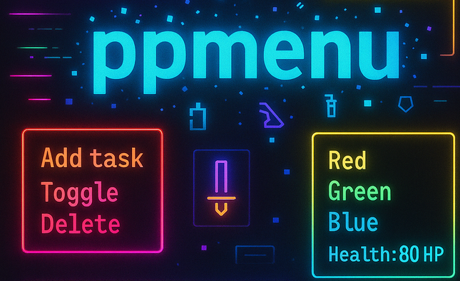

# Pure Python Menu (PPMenu)

> A simple, powerful, and fast terminal menu system for Python.

---



## What is PPMenu?

PPMenu is a lightweight **pure Python** menu builder focused on:
- **Quick navigation** with arrow keys, vim keys, and quick jumps
- **ALT+key quick-jumps** for professional control
- **Full customization**: titles, carts, dynamic displays
- **No external dependencies** — works everywhere!

Built for terminal applications, system tools, games, shops,  
and anywhere a clean text menu is needed.

---

## Features

- 🧭 Navigate with arrow keys, `hjkl`, quick letters
- ⚡ Jump instantly with quick letters (`[f] File`, `[o] Open`, etc.)
- ✨ ALT+Quick-Jump support for professional Vim users (only `h/j/k/l`)
- 🎨 Custom color schemes (titles, selected items, submenus)
- 🛠️ Full extensibility: override parts of the display
- 🧹 100% clean PEP8 code, full type hints
- 🔥 Fully covered with real Pytest tests

---

## Installation

**Option 1: Local Project - istall with pip**

```bash
uv pip install ppmenu

# or

pip install ppmenu
```

**Option 2: Local Project**

Clone the repository:

```bash
git clone https://github.com/sergey-samoylov/ppmenu.git
cd ppmenu/
```

Install development dependencies (optional, for testing):

```bash
pip install pytest
```

---

## Quick Usage Example

Create a quick menu in seconds:

```python
from ppmenu import PPM

def say_hello():
    print("Hello, world!")

menu_structure = {
    '[h] Hello': say_hello,
    '[q] Quit': lambda: exit(0),
}

menu = PPM(menu_structure, title='My Simple Menu')
menu.run()
```

✅ Arrow keys and Vim-keys move.  
✅ Press `h` to run "Hello".  
✅ Press `q` to quit.

---

## Enjoy projects in examples/

Have a taste how it might work with your own projects by launching  
one of these simple apps:

- demo
- Cozy Coffee Shop
- English Quiz

All are in `examples` directory.

Will happily create a file with a list of your projects, that use PPMenu.

---

## Development & Testing

Run all tests:

```bash
pytest
```

(Optional: add `pytest.ini` with `[pytest] pythonpath = .` for clean imports.)

---

## Contributing

Contributions are welcome!  
Feel free to:
- Open issues
- Suggest improvements
- Submit pull requests

Let's make `PPMenu` even better together!

📢Please follow the [Code Style Guide](CODE_STYLE.md) before submitting pull requests.

---

## License

This project is licensed under the **GNU General Public License v3.0** (GPLv3).

See [LICENSE](LICENSE) file for details.

---

## Author

Made with ❤️ by **Sergey Samoylov**

